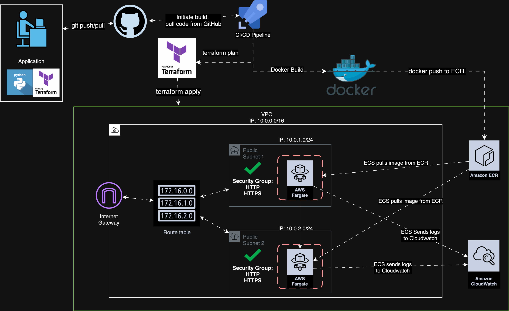

# MusicBot

## Purpose

## Resources Used:
- AWS
  - AWS ECS (Fargate)
    - Task Definition
  - AWS VPC
    - Subnets
    - Security Groups
    - Internet Gateways
  - AWS ECR
  - AWS CloudWatch
    - Log groups
    - Log streams
  - AWS IAM
    - IAM Role
    - IAM Policy
- Docker
- Python
### Architecture Diagram
